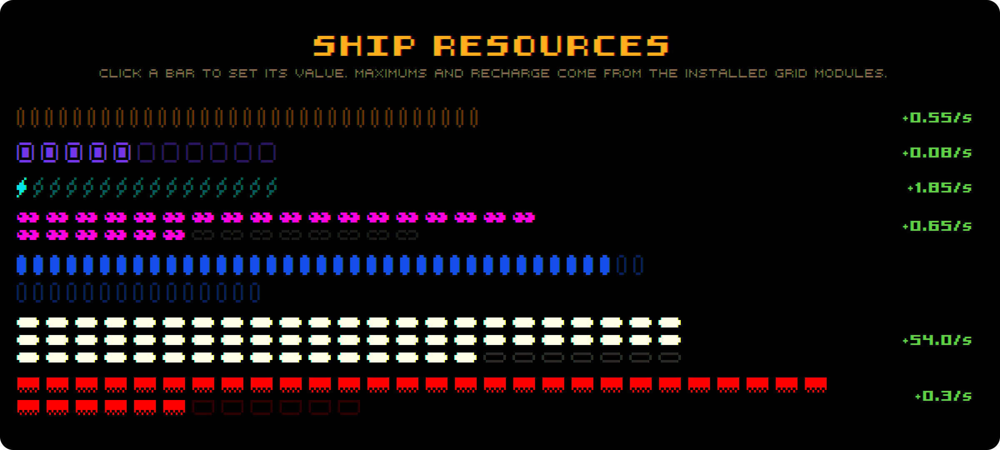
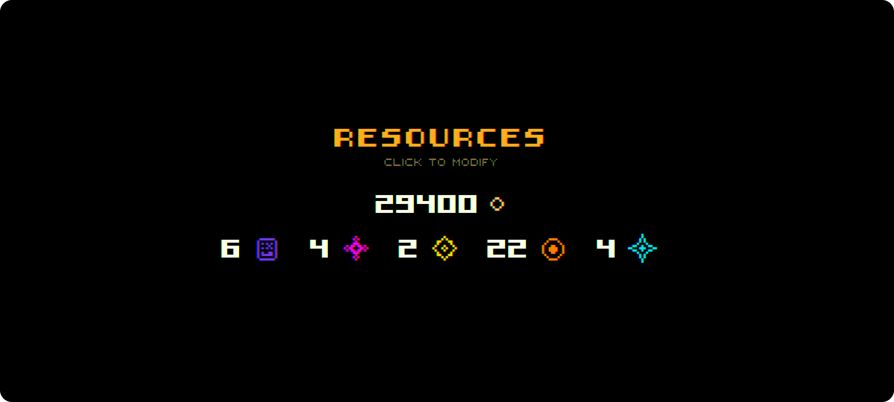
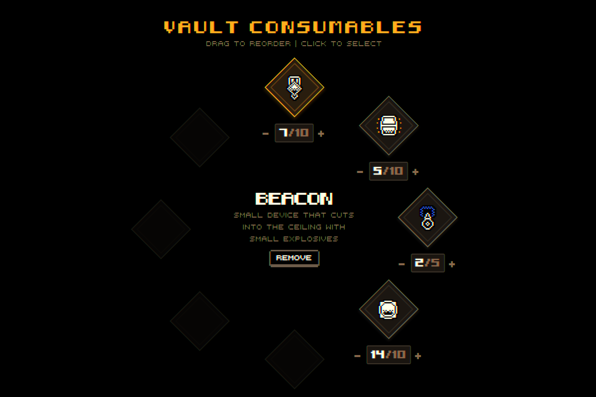
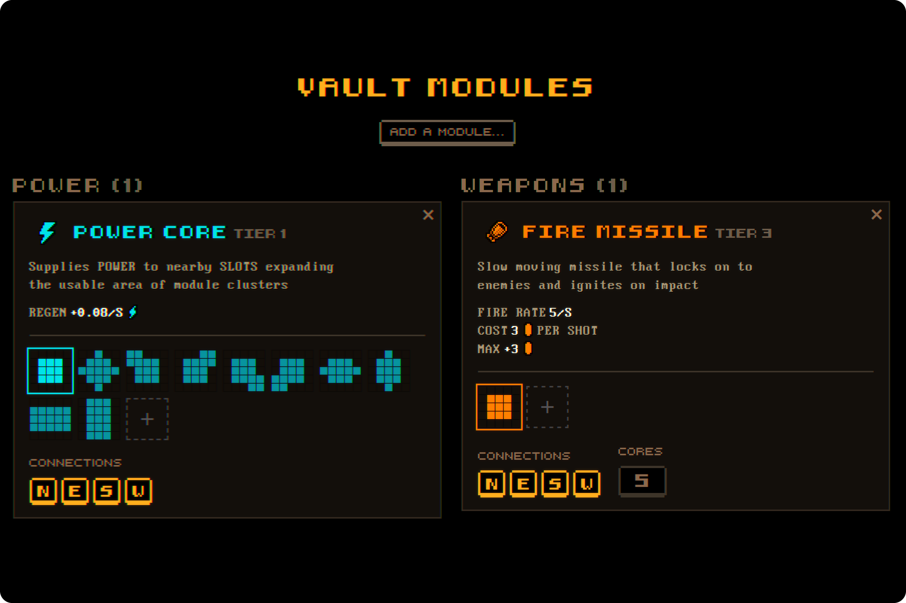

<p align="center">
  
</p>

<p align="center">
  <b>A beautiful save editor for <a href="https://store.steampowered.com/app/2707980/PUNK/">PUNK</a>.</b><br />
  A Web & Desktop app to modify your PUNK savegames directly on disk, featuring a faithful UI/UX, advanced module editing that goes beyond the game's vanilla scope, raw game data access, and more. 
</p>

<p align="center">
  <a href="https://punk-editor.henkys.dev"><b>Open in Web</b></a>
  &nbsp;&nbsp;&bull;&nbsp;&nbsp;
  <a href="https://github.com/telefonsquid/punk-save-editor/releases/latest"><b>Download Desktop App</b></a>
</p>

<p align="center">
  <a href="https://github.com/telefonsquid/punk-save-editor/releases/latest">
    
  </a>
  <a href="LICENSE">
    
  </a>
</p>

---

## Features

- **Modifies Saves in Place*** — open your save folder, change what you want, hit save. The first write backs the whole folder up as `*.bak`.
- **Edit Ship Resources** — fuel, health, electrons and the rest, clamped to the maximums your module grid actually supports.
- **Edit Resources & Consumables** — shared resources, ingredients and consumables, edited on the game's own icons and item art.
- **Edit Modules** — add and remove vault modules, wire up connections and power cores, and paint custom area-of-effect fields.
- **Edit Raw Game Data** — every value in every save file is reachable through the raw editor
- **Create Custom Modules** — create user-defined item grids up to a size of 9x9
- **Faithful UI/UX** — the editor is designed to mimick the game's interface.
- **Runs Everywhere** — as a website and as a native desktop app for Windows, macOS and Linux with x86_64, ARM and Portable builds.
- **A reverse-engineered format, documented** — the LZF + Odin Serializer binary save format was cracked for this project and is written up in [docs/save-format.md](docs/save-format.md).

\* *Firefox & Safari don't support writing to the local filesystem and rely on a downloadable .zip file instead.*

## Compatibility

| PUNK version | Status | Editor Version |
| --- | --- | --- |
| v0.12.10 | ✅ Supported | 1.0.0 |
| v0.12.0 - v0.12.9 | ⚠️ Untested \| Might Work | 1.0.0 |
| v0.6.0 - v0.11.0 | ❌ Untested \| Most Likely Broken | – |

The first save writes a `*.bak` of every file in the folder — not just the edited ones — so reverting restores the run whole, map included.

## Screenshots

<table>
  <tr>
    <td width="50%"></td>
    <td width="50%"></td>
  </tr>
</table>
<table>
  <tr>
    <td></td>
    <td></td>
  </tr>
</table>

## Roadmap

- **Module grid editor** — place and move modules on the ship grid visually, exactly mirroring the game's ui.
- **Map editor (maybe)** — edit the map, with the possibility of fully custom maps.

Ideas and bug reports are welcome in the [issues](https://github.com/telefonsquid/punk-save-editor/issues). I'm dedicated to support this project throughout the game's lifecycle.

## AI Disclosure

> This project was supported by AI-assisted coding tools. In fact, about ~80% of the code was generated using Claude (Opus 4.6), including the entire save format reverse engineering. Large chunks of the UI however were hand-crafted. I am a full stack developer and have been working with SvelteKit for years, so there was a lot of direction and code review involved. This is my very first venture into "vibe coding", and while I was highly impressed with the speed of which I was able to put this together, the overall code quality and structure is nowhere near my usual standards. I'm all too aware and concerned about the negative effects of AI on society, the environment, and the world as a whole and in no way endorse it. Yet, I felt the need to at least familiarize myself with the technology that might soon replace- or completely restructure my profession.

## Development

SvelteKit + Tauri 2, one codebase for web and desktop. [bun](https://bun.sh) is the package manager.

```sh
bun install
bun run dev          # test website at http://localhost:5173
bun run tauri dev    # test desktop app
bun run build        # static site into build/
bun run tauri build  # desktop installers
```

### Regenerating game data

The JSON under `src/lib/game/` (asset names, module info/effects, icons) is extracted from the installed game. After a game update:

```sh
python -m venv .venv
.venv/Scripts/pip install UnityPy TypeTreeGeneratorAPI Pillow
bun run extract      # or: bun run extract "<path-to>/PUNK Playtest/Punk_Data"
```

See [docs/migration.md](docs/migration.md) for the full runbook, [docs/save-format.md](docs/save-format.md) for the save format, and [docs/editor-internals.md](docs/editor-internals.md) for how the app is wired. Release notes live in [CHANGELOG.md](CHANGELOG.md); the release procedure is in [CLAUDE.md](CLAUDE.md).

## License

The editor is [MIT](LICENSE) licensed — use it, fork it, ship it, just keep the notice.

That covers the code written for this project. It does not cover PUNK's own art: the item icons, module sprites and fonts under `src/lib/game/` and `static/` are extracted from the game and belong to its developer. They are here so the editor can mirror the game's interface, and are not mine to relicense.
